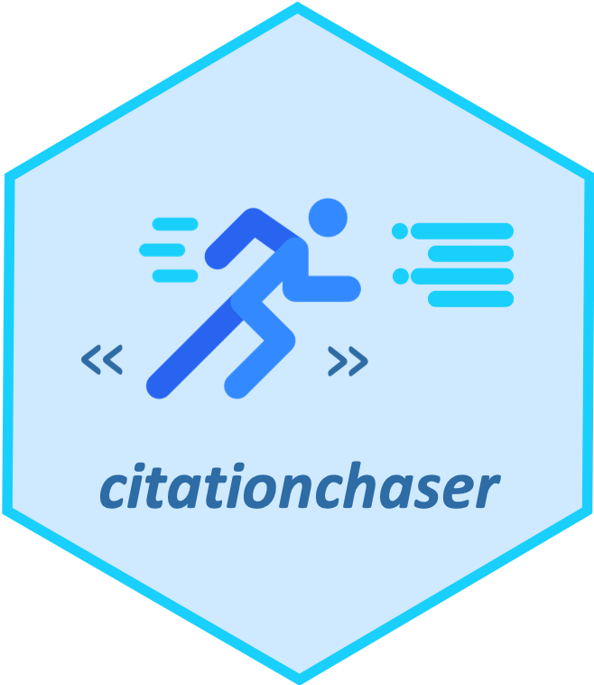

# citationchaser 

In searching for research articles, we often want to obtain lists of references from across studies, and also obtain lists of articles that cite a particular study. In systematic reviews, this supplementary search technique is known as 'citation chasing': forward citation chasing looks for all records citing one or more articles of known relevance; backward ciation chasing looks for all records referenced in one or more articles. 

Traditionally, this process would be done manually, and the resulting records would need to be checked one-by-one against included studies in a review to identify potentially relevant records that should be included in a review. 

This package contains functions to automate this process by making use of the Lens.org API. An input article list can be used to return a list of all referenced records, and/or all citing records in the Lens.org database (consisting of PubMed, PubMed Central, CrossRef, Microsoft Academic Graph and CORE; 'https://www.lens.org'). 

USERS MUST OBTAIN A TOKEN FOR THE LENS.ORG SCHOLARLY API (<a href="https://www.lens.org/lens/user/subscriptions#scholar" target="_blank">available for free here</a>). The API may be time limited, but not rate limited. Requests for tokens may need initial approval from The Lens.

A shiny app version of the package is available [here](https://estech.shinyapps.io/citationchaser/).

Please cite as: 
Haddaway, N. R., Grainger, M. J., Gray, C. T. 2021. citationchaser: An R package and Shiny app for forward and backward citations chasing in academic searching. doi: <a href="https://doi.org/10.5281/zenodo.4543513" target="_blank">10.5281/zenodo.4543513</a> 
<a id="raw-url" href="https://raw.githubusercontent.com/nealhaddaway/citationchaser/master/inst/extdata/citation.ris">Citation in .ris format (right click 'Save Link As')</a>

<!-- badges: start -->

<!-- badges: end -->
